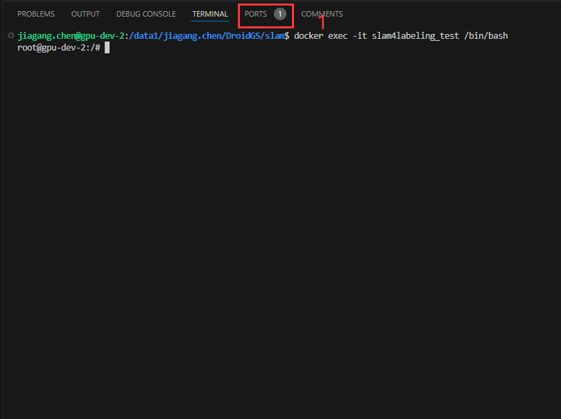
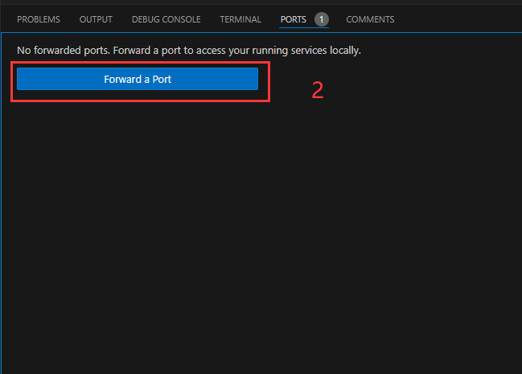
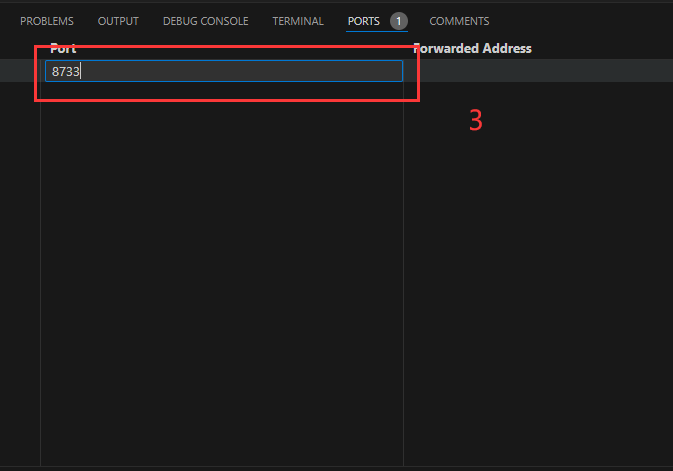
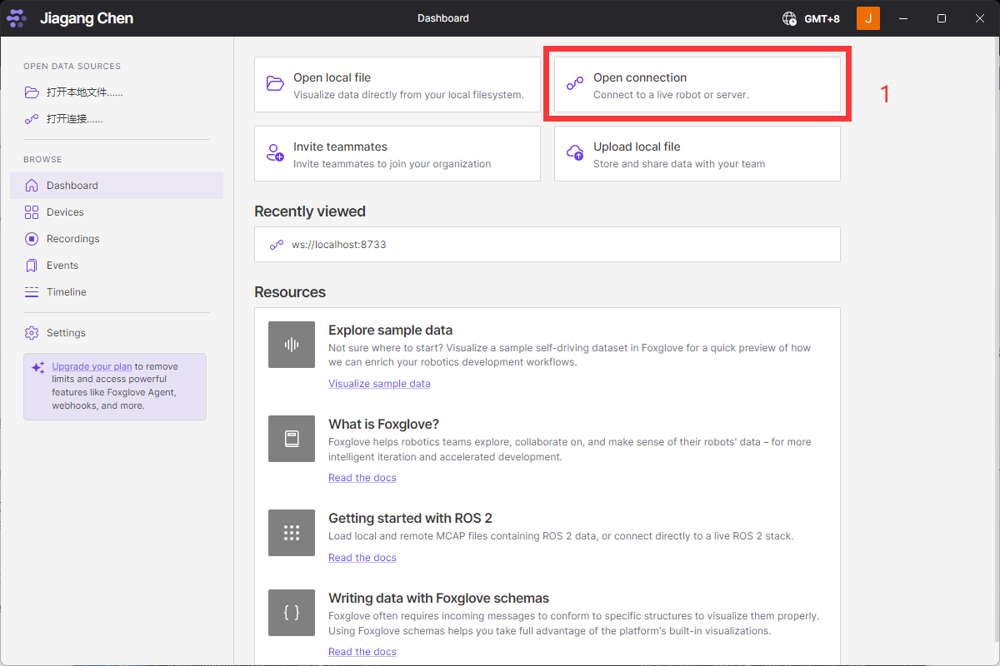
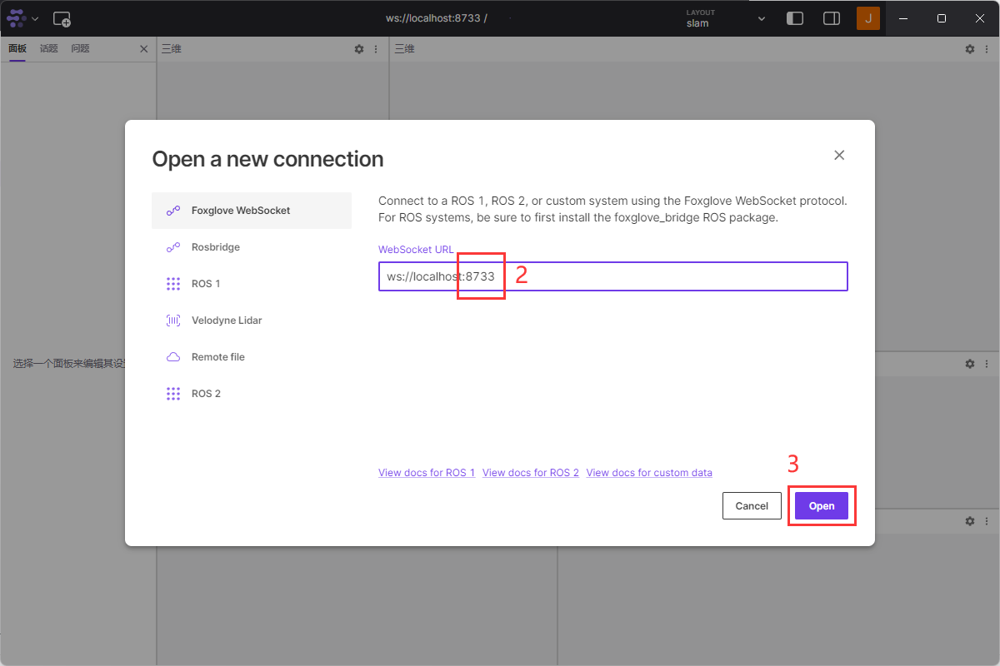
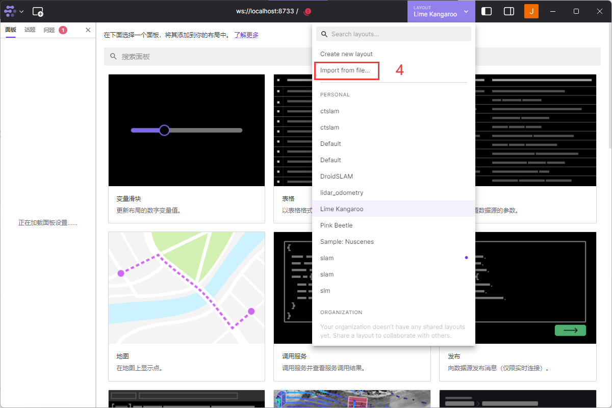
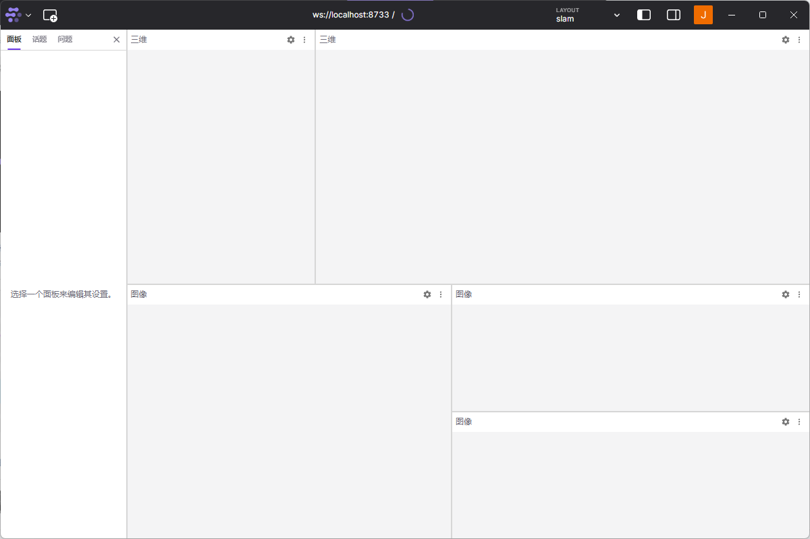
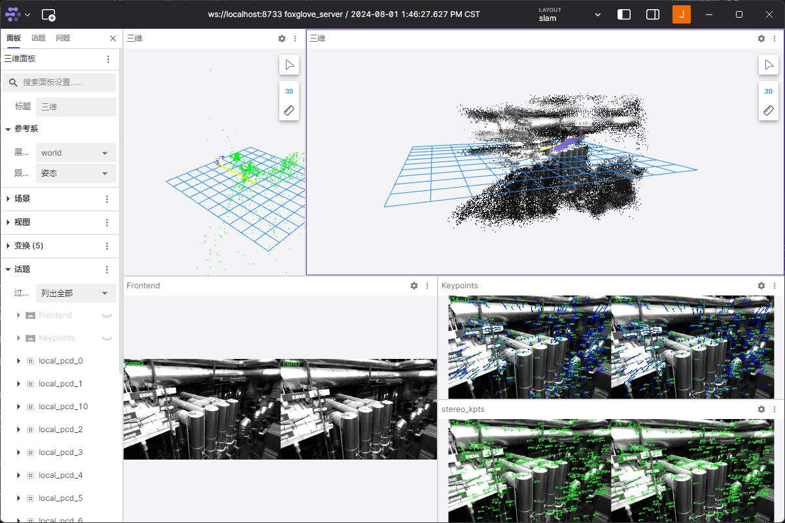

# HOW TO VISUALIZE

## 1. vscode

#### **Step 0**: click PORTS.

#### **Step 1**: click Forward a Port.

#### **Step 2**: set port to Visualizer.port_num in [yaml file](../configs/eruco/mh02.yaml).

## 2. foxglove

#### **Step 0**: download [foxglove](https://foxglove.dev/download) and sign in.

#### **Step 1**: click open connection.

#### **Step 2**: set port to Visualizer.port_num in [yaml file](../configs/eruco/mh02.yaml).

#### **Step 3**: import layout from [json file](./slam.json).

#### **Step 4**: wait for demo run.

#### **Step 5**: final visualizer result.

